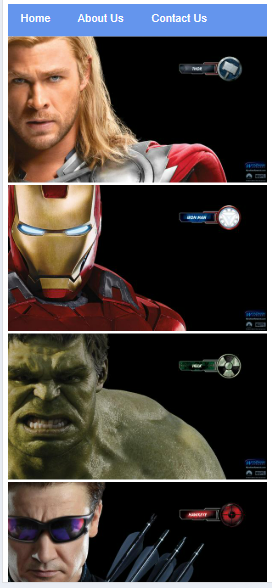

# 🦸 Avengers App

A simple and fun **webpage gallery** showcasing Marvel's iconic Avengers heroes. Built using **HTML** and **CSS** only — no JavaScript.

## 🔍 Overview

This project displays a clean, responsive gallery of Avengers characters, including their images and names. It's a beginner-friendly project focused on layout and styling.

## ✨ Features

- Static gallery of Avengers
- Pure HTML & CSS — no JavaScript

## 📸 Preview

(images/screenshot.png) <!-- Optional: replace with your actual screenshot path -->

## 🛠️ Tech Stack

- HTML5
- CSS3

## 📁 Folder Structure

Avengers-App/
│
├── index.html # Main HTML file
├── styles.css # CSS styles
└── images/ # Folder containing Avenger images
